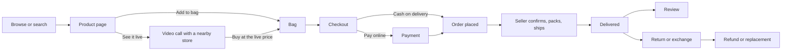
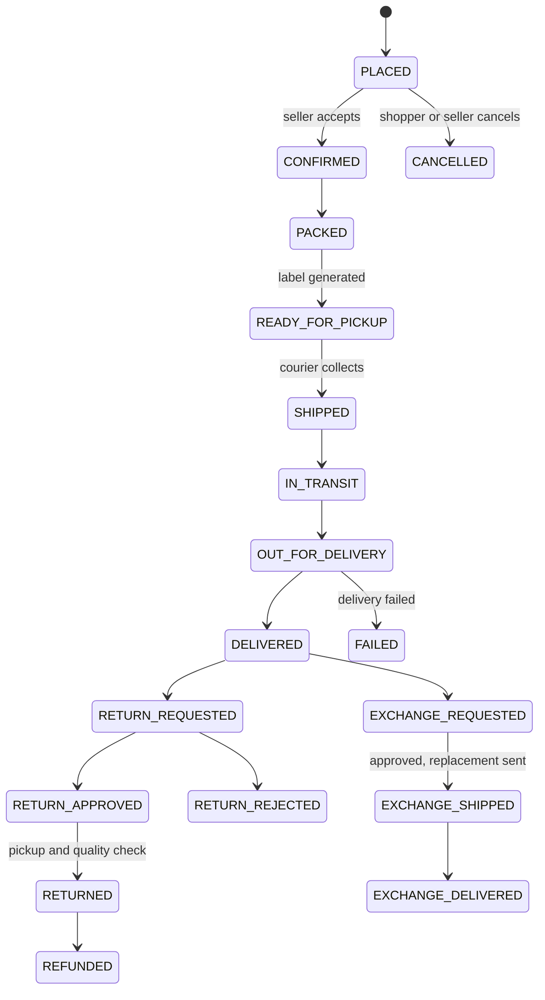
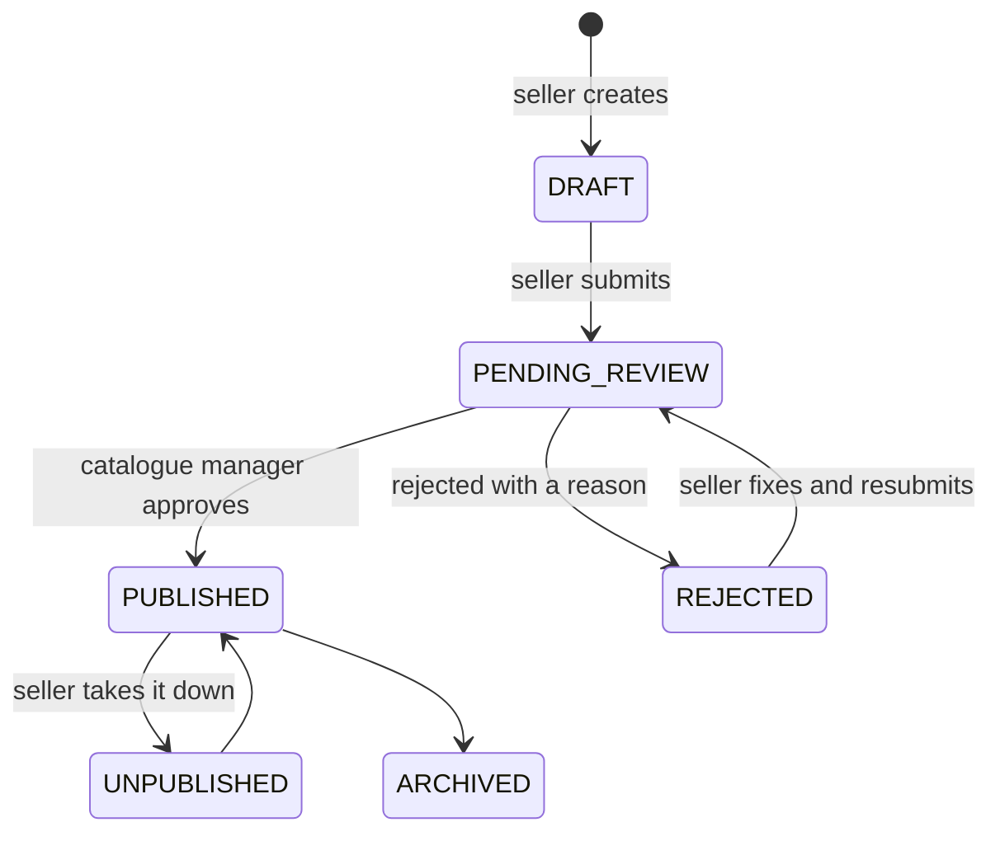
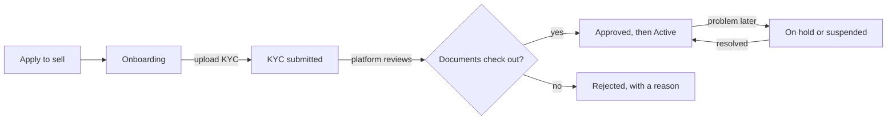
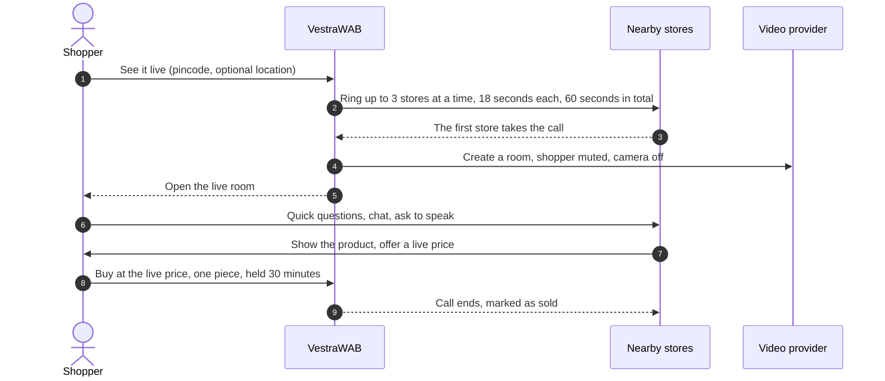
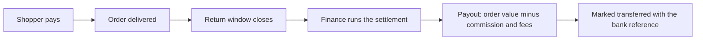
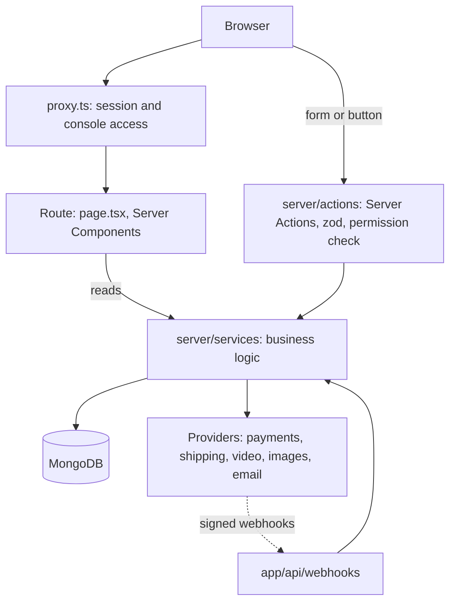

<div align="center">


# VestraWAB

### A multi-vendor fashion marketplace for India, with live video shopping from nearby stores

**Storefront · Seller console · Admin console** on one Next.js 16 codebase

<br />


<br />

[What it is](#-what-is-vestrawab) ·
[Quick start](#-quick-start) ·
[Every page](#-every-page) ·
[Shopper guide](#-guide-for-shoppers) ·
[Seller guide](#-guide-for-sellers) ·
[Admin guide](#-guide-for-the-platform-team) ·
[How it flows](#-how-things-flow) ·
[Architecture](#-architecture) ·
[Deploying](DEPLOYMENT.md)

</div>

---

## 🧭 What is VestraWAB?

VestraWAB is an online marketplace where **independent fashion, beauty and lifestyle sellers** open their own stores and **shoppers across India** buy from them in one place, with one bag, one checkout and one account.

It is built for how India shops:

- **Prices in rupees, GST on every invoice**, split into CGST and SGST or IGST depending on where the parcel goes.
- **Cash on delivery** alongside UPI, cards, net banking and wallets.
- **Pincode-aware** delivery, serviceability and matching.
- **See it live**: a shopper can ask a nearby store that stocks a piece to show it on a video call, haggle, and buy inside the call.

There are **three applications in one codebase**, one for each kind of person who uses it:

| | Who it is for | Where it lives | What they do there |
|---|---|---|---|
| 🛍️ **Storefront** | Shoppers, signed in or not | `/` | Browse, search, watch reels, see products live, buy, track, return, review |
| 🏪 **Seller console** | Store owners and their staff | `/seller` | List products, manage stock, fulfil orders, ship, handle returns, take live calls, get paid |
| 🛡️ **Admin console** | The platform team | `/admin` | Approve sellers and listings, run offers and the homepage, handle support, refunds and payouts |

One sign-in page serves everyone. After signing in, each person lands in the right place for their role.

---

## ✨ Highlights

<table>
<tr>
<td width="33%" valign="top">

**🛍️ For shoppers**

- Mega menu, search and filters by size, colour, price, brand and rating
- Product pages with a size guide, fit feedback and delivery estimates
- One bag across many sellers, save for later, wishlist
- Guest checkout, or saved addresses when signed in
- Coupons, automatic promotions and store credit
- Order tracking with courier updates and GST invoices
- Returns, exchanges and refunds from the order page
- Reviews with fit feedback, support requests, notifications
- **See it live** video calls and **Reels**

</td>
<td width="33%" valign="top">

**🏪 For sellers**

- Guided onboarding with KYC documents
- Listing editor with sizes, colours, photos and SKUs
- Live inventory with low-stock warnings
- Order queue with a dispatch timer
- Shipping labels with barcodes, manifests and tracking
- Return and exchange decisions with quality checks
- Earnings, settlements and payout statements
- **Live desk**: go live, take calls, quote a price on camera
- Analytics and store settings

</td>
<td width="33%" valign="top">

**🛡️ For the platform team**

- Dashboard and analytics across the marketplace
- Seller approval, holds and suspensions
- Listing review before anything goes live
- Orders, payments, manual refunds and returns
- Settlements and payouts to sellers
- Coupons, promotions and the homepage
- Review moderation and a support desk with SLAs
- Users, roles and an audit log of every sensitive action

</td>
</tr>
</table>

**Built to run for real:** rate limits on every sensitive action, a startup check that refuses to start with missing secrets, a health check for load balancers, signed webhooks, security headers, accessibility audits and end-to-end smoke tests. See [DEPLOYMENT.md](DEPLOYMENT.md).

---

## 🚀 Quick start

### What you need

| Tool | Version | Why |
|---|---|---|
| **Node.js** | 24 (pinned in `.nvmrc`) | Next.js 16 will not run on older versions |
| **MongoDB** | 6 or 7 | The only database. A local standalone server is fine |
| **npm** | comes with Node | Package manager |

### Run it locally

```bash
# 1. Get the code
git clone https://github.com/balram2002/Vestra.git
cd Vestra

# 2. Use Node 24
nvm use          # reads .nvmrc

# 3. Install
npm ci

# 4. Configure: copy the example and set at least MONGODB_URI and AUTH_SECRET
cp .env.example .env.local

# 5. Fill the database with demo stores, products, customers and a year of orders
npm run seed

# 6. Start
npm run dev      # http://localhost:3000
```

> [!TIP]
> Everything works **without any third-party account**. Payments, shipping, live video, email and image hosting all fall back to built-in simulations when their keys are empty, and each one says so on screen or in the log. Add real keys only when you need them.

> [!WARNING]
> `npm run seed` **deletes every collection** before loading demo data. Run it on your laptop or a staging database, never in production.

### Demo accounts

After `npm run seed`, every account uses the password **`vestra123`**.

| Role | Email | Lands on |
|---|---|---|
| 👤 Shopper | `ananya.iyer@example.com` | Storefront |
| 🏪 Seller (store owner) | `mora01@seller.vestra.test` | Seller console |
| 🏪 Seller (another store) | `asok01@seller.vestra.test` | Seller console |
| 👑 Super admin | `superadmin@vestra.test` | Admin console, everything |
| 🛡️ Admin | `admin@vestra.test` | Admin console |
| 📦 Operations | `ops@vestra.test` | Orders, shipments, returns |
| 💰 Finance | `finance@vestra.test` | Payments, refunds, settlements |
| 🎧 Support | `support@vestra.test` | Support desk, returns, reviews |
| 🗂️ Catalogue manager | `catalog@vestra.test` | Listing approvals, categories |
| 📣 Marketing manager | `marketing@vestra.test` | Coupons, promotions, homepage |

Other seeded sellers follow the pattern `<store-code>@seller.vestra.test`, and customers `<first.last>@example.com`.

### Try the headline feature in two minutes

1. Open a private window and sign in as **`mora01@seller.vestra.test`**. Switch **Go live** on in the top bar of the seller console.
2. In a normal window, open any product from that store and press **See it live**. Enter the store's pincode.
3. The seller's console rings with a call card. Press **Take the call**.
4. Both sides are now in a call room. Send a quick question, offer 10% off from the seller side, and buy it from the shopper side at the live price.

---
## 🗺️ Every page

Pages are grouped the way the code groups them. "Who" is who can open the page: **anyone**, a **signed-in** shopper, a **seller**, or a member of the **staff** (each admin page also checks the staff member's own permission).

### 🛍️ Storefront: browsing and discovery

| Page | Address | What it does | Who |
|---|---|---|---|
| Home | `/` | Hero carousel, category rails, product rails, brands, featured stores and offers. The sections and their order are managed from the admin **Homepage** page | anyone |
| All categories | `/categories` | Every department (women, men, kids, beauty, footwear, accessories, home) and what sits under it | anyone |
| Category | `/category/[slug]` | Products in one category, with filters (size, colour, price, brand, rating, discount) and sorting | anyone |
| Search | `/search?q=` | Results for a search, with the same filters and sorting | anyone |
| Product | `/product/[slug]` | Photo gallery, price, sizes and colours, size guide, delivery and return terms, reviews with fit summary, **Add to bag** and **See it live** | anyone |
| All brands | `/brands` | Every label sold on the marketplace | anyone |
| Brand | `/brand/[slug]` | One brand's story and products | anyone |
| All stores | `/stores` | Every verified seller | anyone |
| Store | `/store/[slug]` | One seller's shop front, rating, policies and products | anyone |
| Wishlist | `/wishlist` | Saved products; guests keep theirs until they sign in, then it merges | anyone |
| Help | `/help/[slug]` | Shipping, returns, refunds, size guide and contact pages | anyone |
| Legal | `/legal/[slug]` | Terms, privacy, returns policy and grievance officer | anyone |
| About | `/about` | The company | anyone |
| Sell with us | `/sell-with-us` | Why and how to open a store | anyone |
| Apply to sell | `/sell-with-us/apply` | The seller application: business details, GST, bank account, pickup address | anyone |

### 🎥 Live shopping and reels

These open **full-screen**, without the site header and footer.

| Page | Address | What it does | Who |
|---|---|---|---|
| Reels | `/reels` | Short vertical videos from local stores. Swipe, then shop the product | anyone |
| Finding a store | `/live/finding/[id]` | After **See it live**: nearby stores being rung, with a countdown. Try again if nobody answers | the shopper who asked |
| Live room | `/live/session/[id]` | The call. The store's video fills the screen with the product, price and **Buy** over it. Quick questions, chat, ask to speak, size picker, share | the shopper in the call |
| Demo room | `/live/room/[id]` | The built-in meeting screen used when no video provider is configured | people in the call |

### 🧺 Bag, checkout and orders

| Page | Address | What it does | Who |
|---|---|---|---|
| Bag | `/bag` | Items grouped by seller, quantities, save for later, coupons, offers applied automatically, store credit, and warnings (sold out, price changed) | anyone |
| Checkout | `/checkout` | Delivery address (saved, added on the spot, or typed as a guest), payment method, and the final total | anyone |
| Payment | `/checkout/payment/[orderId]` | The payment step for online methods, with a retry if a payment fails | the buyer |
| Your orders | `/orders` | Order history | signed-in |
| Order | `/orders/[id]` | One order: each seller's parcel, status timeline, courier tracking, invoice, and **cancel**, **return**, **exchange** and **write a review** where allowed | the buyer (guests via the link they were given) |
| Invoice | `/invoice/[id]` | A GST tax invoice laid out for printing on A4 | the buyer, the seller, staff |

### 👤 Your account

| Page | Address | What it does | Who |
|---|---|---|---|
| Overview | `/account` | Recent orders, shortcuts, appearance (light, dark or system) | signed-in |
| Profile | `/account/profile` | Change name and phone, change password | signed-in |
| Addresses | `/account/addresses` | Add, edit, remove and choose the default delivery address (up to 10) | signed-in |
| Returns and refunds | `/account/returns` | Every return and exchange and where its refund stands | signed-in |
| Your reviews | `/account/reviews` | Reviews you have written and any reply from the seller | signed-in |
| Notifications | `/account/notifications` | Order, delivery, refund and offer updates; mark as read | signed-in |
| Help and support | `/account/support` | Open a support request (optionally about an order), follow the conversation and reply | signed-in |

### 🔐 Signing in

| Page | Address | What it does |
|---|---|---|
| Sign in | `/login` | One sign-in for shoppers, sellers and staff. Returns you to where you were headed |
| Create an account | `/register` | Name, email, password and optional phone |
| Forgot password | `/forgot-password` | Sends a reset link by email |
| Reset password | `/reset-password` | Where the reset link lands; choose a new password |
| Confirm email | `/verify-email` | Where the confirmation link lands |

### 🏪 Seller console (`/seller`)

| Page | Address | What it does |
|---|---|---|
| Dashboard | `/seller` | The last 30 days against the 30 before: sales, orders, what needs doing today |
| Application | `/seller/onboarding` | Where a new store's application stands, and the KYC documents still needed |
| Orders | `/seller/orders` | New orders to confirm, pack and dispatch within the SLA, with a countdown |
| Shipments | `/seller/shipments` | Generate labels, hand parcels to the courier, close a manifest for each pickup run |
| Shipment | `/seller/shipments/[id]` | One parcel: contents, AWB, tracking timeline and label |
| Shipping label | `/seller/shipments/[id]/label` | A 4×6 inch thermal label with barcodes |
| Returns | `/seller/returns` | Approve or decline return and exchange requests, then record the quality check when the parcel arrives |
| Products | `/seller/products` | Every listing with its status, stock and price |
| New listing | `/seller/products/new` | Start a listing: title, brand, category, description, price |
| Listing | `/seller/products/[id]` | The listing editor: details, sizes and colours, stock per size, photos, then submit for review |
| Inventory | `/seller/inventory` | Live stock for every size, editable in place |
| Earnings | `/seller/earnings` | Money earned, held and paid, and when the next payout clears |
| Settlements | `/seller/settlements` | Payout statements with every order, fee and deduction |
| Analytics | `/seller/analytics` | 90 days of trading: revenue, best sellers, returns, live-call conversion |
| Settings | `/seller/settings` | Store profile, return policy, pickup locations and payout account |
| Live call | `/seller/live/[id]` | The store's side of a live call: video, the shopper's messages, raised hands, offer a price, end the call |

The **Live desk** switch in the top bar of every seller page opens and closes the store for live calls, and incoming calls pop up wherever the seller is.

### 🛡️ Admin console (`/admin`)

| Page | Address | What it does | Needs permission |
|---|---|---|---|
| Dashboard | `/admin` | The last 30 days against the 30 before, and the queues that need attention | any staff |
| Analytics | `/admin/analytics` | Trade, revenue and what the platform keeps | analytics |
| Orders | `/admin/orders` | Every order on the platform, searchable | orders |
| Order | `/admin/orders/[orderNumber]` | One order from the operations side, with a manual refund for what the return flow cannot express | orders, refunds |
| Payments | `/admin/payments` | Every payment attempt with the provider reference, for reconciliation | finance |
| Returns | `/admin/returns` | Every return, and who pays for it | returns |
| Settlements | `/admin/settlements` | Run seller payouts, mark them transferred, or hold them | finance |
| Products | `/admin/products` | The listing review queue: approve or reject with a reason, and audit what is live | catalogue |
| Reviews | `/admin/reviews` | Publish held reviews, reject, or take down published ones | review moderation |
| Categories | `/admin/categories` | The category tree: add categories, hide or show them, see tax slab and return policy | catalogue |
| Sellers | `/admin/sellers` | Every store: approve, reject, put on hold, suspend or reinstate | sellers |
| Users | `/admin/users` | Everyone with an account; search, and suspend or reactivate | users |
| Coupons | `/admin/coupons` | Create discount codes and switch them on or off | coupons |
| Promotions | `/admin/promotions` | Create automatic offers (created paused) and switch them live | promotions |
| Homepage | `/admin/cms` | Show or hide each homepage section | content |
| Support | `/admin/support` | Tickets, urgent first; anything past its SLA is flagged | support |
| Ticket | `/admin/support/[id]` | One conversation: reply, add internal notes, change status | support |
| Audit log | `/admin/audit-logs` | Every sensitive action with who did it and the before and after | audit |
| Settings | `/admin/settings` | Platform-wide thresholds and what each role may do | settings |

Every console page has the same layout: a sidebar you can collapse to icons, a search box (**Ctrl + K** or **⌘ K**) that jumps to any page, breadcrumbs, and a user menu with the theme switch and sign-out.

### ⚙️ Behind the scenes

| Address | What it is |
|---|---|
| `/api/health` | Health check for load balancers: 200 when the app and database are up, 503 otherwise |
| `/api/webhooks/payments` | Signed payment updates from the payment provider |
| `/api/webhooks/eshopbox` | Signed courier tracking updates |
| `/api/live/request/[id]`, `/api/live/seller` | Polling endpoints for live shopping |
| `/api/media/...` | Image upload and delivery |
| `/sitemap-index.xml`, `/robots.txt` | For search engines |

---

## 🛍️ Guide for shoppers

**You do not need an account to buy.** An account adds saved addresses, order history, reviews, support and store credit.

### Find something

- Use the **menu** at the top (or the **menu button** on a phone) to open a department, or the **search** box.
- On a category or search page, **filter** by size, colour, price, brand, rating and discount, and **sort** by what matters to you. Active filters show as chips you can remove.
- Tap the **heart** on any product to save it to your **wishlist**.
- Open **Reels** from the bottom bar on a phone to watch short videos from stores and shop straight from them.

### Decide

- On a product page, pick a **colour** and **size**. The **size guide** shows measurements; the **fit summary** tells you whether other buyers found it small, true or large.
- Check the **delivery estimate** and **return** terms before you buy.
- Not sure? Press **See it live** (see below).

### See it live

1. Press **See it live** on a product page and enter your **pincode**. Optionally allow your precise location for better matching; it is never shown to the store.
2. We ring nearby stores that stock the product (or its brand). You watch the stores being called, with a one-minute countdown.
3. The first store to answer opens a **video call**. You join **muted with your camera off**; only the store is on video.
4. In the call you can:
   - tap a **quick question** (another colour, is my size available, show the fabric) or **type a message**;
   - **ask to speak**, and the store unmutes you;
   - pick your **size** and **buy** without leaving the call. If the store offered a **live price**, that is the price in your bag (for one piece, held for 30 minutes);
   - **share** the product, or **end** the call.
5. When the call ends you see a summary with the price still held, a **Buy** button and **Find another store**.

### Buy

1. **Add to bag**. The bag groups items by seller because each seller ships separately.
2. In the bag, apply a **coupon** (the bag lists the ones you can use and how much each saves), see **automatic offers** applied, and choose to use **store credit**.
3. Go to **Checkout**:
   - signed in: choose a saved address or **add one right there**;
   - as a guest: type your email and address.
4. Choose **UPI, card, net banking, wallet** or **cash on delivery**, and place the order.

### After you buy

- **Track** each parcel on the order page: the seller's progress (confirmed, packed, shipped) and the courier's scans.
- Download the **GST invoice** once a parcel has shipped.
- **Cancel** items before they ship.
- After delivery, **return** an item within its return window (you will see "Returnable until…"), or **exchange** it for another size. Refunds go back to the original payment method or to store credit.
- **Write a review** of a delivered item: stars, how it fit, and a few words. It is marked as a verified purchase.
- Need help? **Help and support** in your account opens a conversation with our team; link the order and they have it open when they reply.

### Your account

- **Profile**: your name, phone and password.
- **Addresses**: up to ten, one of them the default.
- **Notifications**: order, delivery, refund and offer updates.
- **Appearance**: light, dark or follow your device.

---

## 🏪 Guide for sellers

### 1. Become a seller

1. Go to **Sell with us** → **Apply**. Enter your business details, **GSTIN**, **bank account** and **pickup address**.
2. Upload your **KYC documents** on the **Application** page (`/seller/onboarding`).
3. The platform team reviews them, usually within two working days. You see the status change from **KYC submitted** to **Approved** and then **Active**.
4. Once active, the whole seller console opens up.

### 2. List a product

1. **Products → New listing**: title, brand, category, description and price. It saves as a **draft**.
2. In the **listing editor**: add **sizes and colours** (the size scale for the category is offered for you), set **stock** for each size, and upload **photos** (the first is the main one).
3. **Submit for review**. A catalogue manager approves it (it goes **Live**) or rejects it with a reason you can fix and resubmit.
4. Later you can **unpublish**, **duplicate** or **archive** a listing.

### 3. Keep stock right

- **Inventory** shows live stock for every size. Change a number and shoppers see it immediately.
- Low stock is highlighted so you can restock before a size sells out.

### 4. Fulfil orders

1. New orders appear in **Orders** with a **dispatch countdown**. Missing the SLA hurts your fulfilment score.
2. **Confirm** and **pack** each order.
3. In **Shipments**, **generate the label** (a 4×6 thermal label with barcodes), print it, and stick it on the parcel.
4. **Close the manifest** when the courier collects the day's parcels.
5. Tracking updates arrive by themselves; you can also refresh a shipment's tracking.

### 5. Handle returns and exchanges

1. Return and exchange requests appear in **Returns**. **Approve** or **decline** each one (declining needs a reason).
2. When the returned parcel arrives, record the **quality check**. A pass refunds the shopper (or ships the replacement for an exchange) and puts the item back on sale.

### 6. Sell live

1. Switch **Go live** on in the top bar. Your store now receives live calls for products you stock, from shoppers nearby.
2. A **call card** pops up with a countdown. Press **Take the call** (or let it pass to the next store).
3. In the call: show the product on camera, read the shopper's **messages** and answer with **quick replies**, see when they **raise a hand** (unmute them from the call's participant list), and send a **live price** in one tap (5, 10 or 15% off) or type your own. The shopper's **Buy** button charges that price.
4. When the call ends you see whether it **sold**. Live calls and their conversion show in **Analytics**.

> [!NOTE]
> A live price cannot go below half the listed price. That protects you from a typo such as ₹189 instead of ₹1,899.

### 7. Get paid

- **Earnings** shows money earned, money on hold, and when the next payout clears. Money is held until an order's return window has closed.
- **Settlements** lists each payout with every order, commission, fee and deduction.

### 8. Your store

- **Settings**: store profile and logo, return policy, pickup locations and payout bank account.
- **Analytics**: 90 days of revenue, best sellers, return rates and live-call results.

---

## 🛡️ Guide for the platform team

Staff sign in at the same `/login` and land in the admin console. **What you can see depends on your role**; see [Roles and permissions](#-roles-and-permissions).

### Daily work by role

| Role | Typical day |
|---|---|
| 🗂️ **Catalogue manager** | Review new listings in **Products** (approve, or reject with a reason). Keep the **Categories** tree tidy. Moderate **Reviews** |
| 🎧 **Support** | Work the **Support** queue, urgent and overdue first. Reply, add internal notes, resolve. Approve **Returns**. Moderate **Reviews** |
| 📦 **Operations** | Watch **Orders** and shipments for delays. Handle **Returns** and cancellations |
| 💰 **Finance** | Reconcile **Payments**. Issue **manual refunds** from an order. **Run settlements**, mark payouts transferred, or hold one. Read the **Audit log** |
| 📣 **Marketing manager** | Create **Coupons** and **Promotions** (promotions start paused; switch them live after checking). Arrange the **Homepage** |
| 🛡️ **Admin** | Everything above, plus approving and suspending **Sellers**, suspending **Users** and reading the **Audit log** |
| 👑 **Super admin** | Everything, plus platform **Settings** and **roles**, which no other role can change |

### Common tasks

<details>
<summary><b>Approve a new seller</b></summary>

1. **Sellers** → open the store with status **KYC submitted**.
2. Check the documents against the GSTIN and bank account.
3. **Approve** (the store can start listing) or **reject** with a reason the applicant will read.
4. Later you can put a store **on hold** or **suspend** it (its listings stop selling) and **reinstate** it.

</details>

<details>
<summary><b>Review a listing</b></summary>

1. **Products** shows listings waiting for review.
2. **Approve** to put it live, or **Reject** with a reason (at least a few words; the seller reads it and is notified).

</details>

<details>
<summary><b>Run an offer</b></summary>

- **Coupons → New coupon**: a code, percent or amount off (or free delivery), a minimum cart value, who can use it, total and per-customer limits, and dates. It works from its start date.
- **Promotions → New promotion**: an automatic offer on everything or on one category, percent or amount off, with dates and an optional limited number of units for a flash sale. It is created **paused**; check it in the table, then switch it on.

</details>

<details>
<summary><b>Refund an order by hand</b></summary>

For a parcel lost in transit, a goodwill gesture or a duplicate charge: **Orders** → open the order → **manual refund**, with the amount (capped at what the order is worth) and a reason. It is logged as a critical action.

</details>

<details>
<summary><b>Pay sellers</b></summary>

**Settlements** → **Run settlement** for a seller to collect every order whose return window has closed. Transfer the money from your bank, then **Mark transferred** with the bank reference, or **Hold** a payout with a reason.

</details>

<details>
<summary><b>Moderate reviews</b></summary>

Most reviews publish immediately. Those containing a link, an email address or a phone number wait in **Reviews → Waiting**. **Publish** or **Reject** (with a reason). A published review can be **taken down**. The product's rating updates every time.

</details>

<details>
<summary><b>Suspend a user</b></summary>

**Users** → search by name or email → **Suspend** with a reason. They are signed out everywhere on their next request and cannot sign in until you **Reactivate** them. Orders already placed carry on. You cannot suspend yourself.

</details>

Every one of these actions is recorded in the **Audit log** with who did it, when, and what changed.

---
## 🔄 How things flow

### A shopper's journey



### An order, item by item

Each seller's part of an order moves on its own. The shopper sees one timeline per parcel.



### A listing



### A new seller



### See it live



Rules the live flow follows: stores within **12 km**, rung **3 at a time** for **18 seconds** each, a **60-second** search, calls capped at **20 minutes**, and an offer can never go below **half the listed price**.

### Money: from a shopper's payment to a seller's bank



---

## 🔑 Roles and permissions

Everyone has one or more **roles**, and each role carries a set of **permissions**. Pages and actions check permissions, not role names, so a new role is a new list of permissions, not a code change.

| What | Shopper | Seller | Seller staff | Support | Operations | Finance | Catalogue | Marketing | Admin | Super admin |
|---|:-:|:-:|:-:|:-:|:-:|:-:|:-:|:-:|:-:|:-:|
| Browse and buy | ✅ | ✅ | ✅ | ✅ | ✅ | ✅ | ✅ | ✅ | ✅ | ✅ |
| Manage own listings and stock | | ✅ | ✅ | | | | | | | |
| Fulfil own orders and shipments | | ✅ | ✅ | | | | | | | |
| Decide returns | | ✅ own | | ✅ | ✅ | | | | ✅ | ✅ |
| See own earnings and settlements | | ✅ | | | | | | | | |
| See every order | | | | ✅ | ✅ | ✅ | | | ✅ | ✅ |
| Refund money | | | | | | ✅ | | | ✅ | ✅ |
| Run and hold payouts | | | | | | ✅ | | | ✅ | ✅ |
| Approve listings, manage categories | | | | | | | ✅ | | ✅ | ✅ |
| Moderate reviews | | | | ✅ | | | ✅ | | ✅ | ✅ |
| Coupons, promotions, homepage | | | | | | | | ✅ | ✅ | ✅ |
| Answer support tickets | | | | ✅ | | | | | ✅ | ✅ |
| Approve and suspend sellers | | | | | | | | | ✅ | ✅ |
| Suspend users | | | | | | | | | ✅ | ✅ |
| Analytics | | | | | ✅ | ✅ | ✅ | ✅ | ✅ | ✅ |
| Audit log | | | | | | ✅ | | | ✅ | ✅ |
| Platform settings and roles | | | | | | | | | | ✅ |

The source of truth is [`src/server/auth/rbac.ts`](src/server/auth/rbac.ts).

---

## 🏗️ Architecture

### Stack

| Layer | Choice |
|---|---|
| Framework | **Next.js 16** App Router with Cache Components and React 19 Server Components |
| Language | **TypeScript 5.9**, strict |
| Styling | **Tailwind CSS 4** on the **Meridian** design tokens (indigo, slate and sand; light and dark) |
| UI primitives | **Radix UI**, **lucide** icons, **framer-motion** spring animations, **sonner** toasts, **recharts** |
| Data | **MongoDB 6+** through the official driver, no ORM |
| Validation | **zod 4** on every Server Action |
| Auth | Signed session cookies (**jose**), scrypt password hashes, role-based access control |
| Email | **nodemailer** over SMTP |
| Tests | **vitest** unit tests, **Playwright** end-to-end smoke tests, **axe** accessibility audits |

### How a request flows



- **Pages read, actions write.** Pages call services directly on the server; every change goes through a Server Action that validates its input with zod and checks the caller's permission before touching anything.
- **Services hold the rules**: the cart, pricing, coupons and promotions, orders, returns, exchanges, settlements, live matching.
- **Every sensitive change is audited** with the before and after.
- **Caching** uses Next.js Cache Components with tags (`product:<id>`, `reviews:<id>`, `taxonomy`...). Mutations invalidate exactly the tags they affect.
- **Providers sit behind interfaces**, each with a simulation, so the whole app runs without any vendor account:

| Area | Real provider | Without keys |
|---|---|---|
| Payments | Razorpay or Stripe (adapter pending, see [status](#-project-status)) | Mock gateway |
| Shipping | Eshopbox | A simulated courier that also produces failures, RTOs and unserviceable pincodes |
| Live video | Zoom (Server-to-Server OAuth) | A demo room on the same site |
| Images | ImageKit | Local disk and the Next.js optimiser |
| Email | Any SMTP server | Printed to the console and saved to `.data/outbox` |

### Route groups

| Group | What is in it | Why it is separate |
|---|---|---|
| `(storefront)` | The shop, product, bag, checkout, orders, account | Shared header, footer and mobile bottom bar |
| `(immersive)` | Reels and live rooms | Full-screen, no site chrome |
| `(auth)` | Sign in, register, password and email pages | A minimal, focused layout |
| `(seller)` | The seller console | The console shell, seller-only |
| `(admin)` | The admin console | The console shell, staff-only |
| `(print)` | Invoices and shipping labels | Print layouts with no navigation |

---

## 📁 Project structure

```text
.
├── src/
│   ├── app/                  Routes (App Router), one folder per page
│   │   ├── (storefront)/     The shop, bag, checkout, orders and account
│   │   ├── (immersive)/      Reels and live rooms
│   │   ├── (auth)/           Sign in, register, password reset, email confirmation
│   │   ├── (seller)/         Seller console
│   │   ├── (admin)/          Admin console
│   │   ├── (print)/          Invoices and labels
│   │   └── api/              Health, live polling, media, webhooks
│   ├── components/           UI, by area: ui, layout, home, commerce, product,
│   │                         checkout, account, orders, console, seller, live, auth
│   ├── server/
│   │   ├── actions/          Server Actions: validated, permission-checked writes
│   │   ├── services/         Business logic
│   │   ├── db/               MongoDB client, collections and indexes
│   │   ├── auth/             Sessions, passwords, roles and permissions
│   │   ├── security/         Rate limits
│   │   ├── payments/  shipping/  live/  media/  email/   Provider adapters
│   │   └── seed/             The demo data generator
│   ├── domain/               Types, enums and state machines shared everywhere
│   ├── lib/                  Pure helpers: money, pricing, tax, coupons, promotions, formatting
│   ├── config/               Site identity, business rules, email, the environment check
│   ├── styles/               Design tokens and global CSS
│   └── proxy.ts              Edge access control for the consoles and account
├── scripts/                  Seed, admin bootstrap, smoke tests and audits
├── public/                   Static assets
├── .github/workflows/ci.yml  Typecheck, lint, tests and build on every push
├── DEPLOYMENT.md             The production checklist
└── AGENTS.md                 Working notes for anyone changing the code
```

---

## 🔧 Environment variables

Copy `.env.example` to `.env.local`. Only two values are needed to run locally; everything else unlocks a real provider.

| Variables | Needed for | Required |
|---|---|---|
| `MONGODB_URI`, `MONGODB_DB` | The database | ✅ always |
| `AUTH_SECRET` | Signing sessions (32+ random characters) | ✅ always |
| `NEXT_PUBLIC_SITE_URL` | Links in emails, canonical URLs | ✅ in production (https) |
| `APP_ENV` | `development`, `staging` or `production`; how strict the startup check is | production |
| `SMTP_*`, `EMAIL_FROM`, `EMAIL_REPLY_TO` | Sending real email | production |
| `PAYMENT_PROVIDER`, `RAZORPAY_*` / `STRIPE_*` | Real payments | production |
| `ESHOPBOX_*`, `ESHOPBOX_MODE` | Real shipping | production |
| `LIVE_PROVIDER`, `ZOOM_*` | Real video calls | optional |
| `NEXT_PUBLIC_IMAGEKIT_*`, `IMAGEKIT_PRIVATE_KEY` | Image hosting and optimisation | recommended in production |

Every variable is explained in [`.env.example`](.env.example). Production rules are in [DEPLOYMENT.md](DEPLOYMENT.md).

---

## 📜 Scripts

| Command | What it does |
|---|---|
| `npm run dev` | Start the development server on port 3000 |
| `npm run build` / `npm run start` | Production build, then serve it |
| `npm run check` | Typecheck, lint and unit tests |
| `npm run verify` | Typecheck, lint and a production build |
| `npm run seed` | **Wipe** the database and load demo data |
| `npm run admin:create -- --email you@company.com --name "Your Name"` | Create the first administrator (prompts for the password) |
| `npm test` | Unit tests |
| `npm run smoke` | Browse to order, end to end |
| `npm run smoke:account` | A brand-new customer: register, add an address at checkout, order, profile, password, support |
| `npm run smoke:reviews` | Write, hold and moderate reviews |
| `npm run smoke:live` / `smoke:live-call` | Live shopping between two browsers, and every control inside the call |
| `npm run smoke:offers` | Coupons and promotions |
| `npm run smoke:guest` | Guest checkout and order privacy |
| `npm run smoke:shipping` / `smoke:exchange` / `smoke:listing` | Parcels and labels, exchanges, the listing editor |
| `npm run smoke:rbac` / `smoke:admin` / `smoke:console` / `smoke:ops` | Access control and the console write paths |
| `npm run smoke:hardening` | Health check, security headers and rate limits |
| `npm run audit:a11y` / `audit:console` / `audit:contrast` / `audit:palette` | Accessibility, console layout at four widths, and the colour palette |

Smoke tests and audits run against a started server (`BASE_URL`, default `http://localhost:3000`) and a seeded database, and clean up after themselves.

---

## 🧪 Quality

- **Unit tests** (vitest) cover pricing, tax, coupons, promotions, inventory, the environment check and more.
- **End-to-end smoke tests** (Playwright) drive real browsers through every critical path, including two browsers at once for live shopping.
- **Accessibility**: axe audits in light and dark mode at desktop and phone widths.
- **Continuous integration**: [`.github/workflows/ci.yml`](.github/workflows/ci.yml) runs typecheck, lint, unit tests, a seed and a production build on every push and pull request.

---

## 🚢 Deploying

Read **[DEPLOYMENT.md](DEPLOYMENT.md)**. In short: Node 24 behind a TLS proxy, MongoDB, `APP_ENV=production` with real provider keys, `npm run build`, `npm run start`, then `npm run admin:create` for the first administrator, and point the payment and courier webhooks at the site. `/api/health` tells your load balancer when a node is ready.

---

## 📍 Project status

What works today, end to end: the storefront, guest and signed-in checkout, cash on delivery, the seller and admin consoles, returns and exchanges, settlements, reviews, support, live shopping and reels, all verified by the smoke tests above.

> [!IMPORTANT]
> **Before taking real money:**
> - **Online payments** run on the mock gateway. The Razorpay and Stripe adapters are not implemented yet; with `PAYMENT_PROVIDER=razorpay` and a secret set, checkout stops with "adapter not implemented".
> - **Starter data for production.** Categories, legal and help pages and the homepage layout currently come only from the demo seed, which also wipes the database. A production database needs a separate loader for that reference data.

Also not built yet: Google Meet as a live provider (it cannot be embedded), SMS notifications, back-in-stock alerts, recently viewed items, sellers replying to reviews, seller-run offers, brand management and bulk product upload.

---

## 🤝 Contributing

1. Read [**AGENTS.md**](AGENTS.md) first. This is Next.js 16: `cookies()`, `headers()`, `params` and `searchParams` are async, runtime reads belong inside `<Suspense>`, and caching uses `"use cache"` with tags.
2. Business rules go in `src/server/services`, writes in `src/server/actions` (validate with zod, check a permission, audit anything sensitive), shared types in `src/domain`.
3. Before you push: `npm run check`, and the smoke test for whatever you touched.

<div align="center">
<br />
<sub>Built with Next.js, React and MongoDB · Made for shoppers, sellers and the people who run the marketplace</sub>
</div>